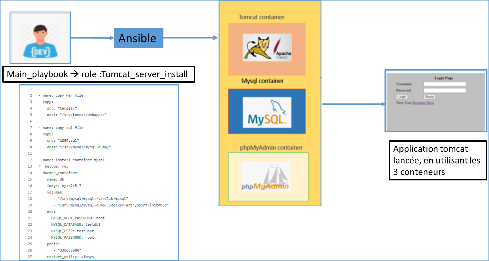

# **Projet d'entreprise Epsilon Corporation**

## Sommaire

[I. Le projet](#I-Le-projet)
&nbsp; &nbsp; [1. Le contexte](#1-Le-contexte)
&nbsp; &nbsp; [2. L'équipe](#2-L'équipe)
[3. Structure](#2-Structure)
[II. Le projet](#I-Le-projet)
[1. Le contexte](#1-Le-contexte)
[2. L'équipe](#2-L'équipe)
[III. Le projet](#I-Le-projet)
[1. Le contexte](#1-Le-contexte)
[2. L'équipe](#2-L'équipe)
  
---

## I. Le projet


### 1. Le contexte :

L'entreprise Epsilon Corporation a besoin de trois applications Web :

* Un blog statique (Jekyll)
* Une application JAVA Tomcat
* Un web serveur Python

La solution Cloud retenue : Amazon web services. Le cloud AWS ne servira que de ressources
VM.

Epsilon Corporation souhaiterait un déploiement de l'infrastructure le plus dynamique possible,
souple , automatisé. (provisionning de l'infrastructure AWS , conteneurisation).

Précision techniques :

Les données des applications (data) devront êtres sur des volumes dediés ISCSI ou NFS.
La mise en place de monitoring serait un plus (outils monitoring).

La securité :
L'infrastructure aws sera accessible par SSH , FTPs, VPN , filtrage accés (Reverse Proxy, Netfilter...)
La présence de chaîne CI/CD est fortement recommandé pour les trois applications web.

Les outils :
* Gitlab - CI/CD
* Serveurs LAMP
* Jenkins
* Containerisation
* Ansible

### 2. L'équipe :

* Amine AHMAMOU
* Romuald SENIGALLIA
* Matthieu RAMANANARIVO
* Moustapha Mohamedou TALL


### TITRE GRAS
**Texte gras** 

## I. Organisation
Organisation qui a été adopter sur ce projet était quasi similaire à une méthodologie agile vue la disparité des niveaux de l'équipe projet,il était obligatore de faire plusieurs mêlées par jour afin de s'aligner sur un objectif commun et de pouvoir débloquer rapidement les points bloquants.
Cette organisation à été la cléf de l'aboutissement de ce projet et de pouvoir.


### 1. 
### 2. 

* liste
* 

Exemple code :
```yaml
---
- hosts: localhost
  connection: local
  gather_facts: False
...
        
# Commentaire

```
### Le serveur web python 
1.Objectif

L'objectif est de mettre en place un serveur web python sur le dépot Gitlab qui va permettre via un commit de faire un build de l'image docker.

2. Travaux 

Pour la mise en place du serveur python, nous avons créer un reprtoire python_serv_install dans notre repertoire roles. On y retrouvera deux sous-répertoire files et tasks, qui contiennent l'ensemble de nos fichiers nécessaire pour la mise en place se notre serveur dont les fichiers simple_server.py,Dockerfile, main.yml et Jenkinsfile.

3.Difficltés 

La première difficulté sur mise en place de serveur web python était de bien comprendre les attendus sur sa fonctionnalité et ses interactions avec les autres serveurs.
La deuxièume difficulé était liée à un travail de recherche sur le web afin de comprendre les bonnes libraries python à importer dont HTTPserver.


 ### Deploiement de l'application Tomcat en utilisant Ansible
 
 1-Contexte :
 
 Suite à la demande de l'entreprise Epsilon pour faire un déploiment  des ses apllications, on a choisi d'utiliser l'outil ansible afin d'automatiser l'installation et le running de l'application Tomcat.
 
 2- Travaux :
 
 Notre démarche consiste à creer 2 playbook, le main playbook sera le playbook qui englobe tous les tasks, par contre le deuxieme playbook (tomcat_serv_insatall) est sous forme d'un role qui copie dans un premier temps les fichiers (files de tomcat et USer.sql) dans les repertoires dédiéset et qui fera l'installation de tomcat, mysql et Phpmyadmin.
 
 3- Diffucultés: 
 
 la difficulté rencontré était l'ajout du nom de l'application et le fichier target correspondant dans le repertoire.
 
### Gitlab

#### Cahier des charges

- [x] Faire un gitlab privé, qui nous permettra d'accéder au code via une addresse.
- [x] Le code devra être dans un dépot pour permettre le versionning du code jekyll.
- [x] Lorsqu'un commit sera effectué sur gitlab, Gitlab CI va effectuer une action qui va générer le code html
- [x] Envoyer le code par une clé ssh pour le déployement

#### Mise en place du Gitlab-ce dans un docker

Création d'un outil de versionning via un docker et ansible.
<u>Fichier de déployement ansible :</u>

```yml=1
- name: start gitlab container
  docker_container:
    name: gitlab
    image: gitlab/gitlab-ce:latest
    restart: yes
    recreate: yes
    privileged: yes
    exposed:
      - 443
      - 80
      - 22
    ports:
      - 443:443
      - 80:80
      - 22:22
    volumes:
      - /srv/gitlab/config:/etc/gitlab:Z
      - /srv/gitlab/logs:/var/log/gitlab:Z
      - /srv/gitlab/data:/var/opt/gitlab:Z
```

#### Mise en place du gilab-runner pour le CI Gitlab :

Le runner est un outil nécessaire au bon fonctionnement de Gitlab CI.
Il permet de lancer dans un docker une image qui va effectué des actions par rapport au code.

<u>Code de déployement Ansible :</u>


```yml=
- name : Installation d'un runner Gitlab
  become: yes 
  docker_container:
    name: gitlab-runner
    image: gitlab/gitlab-ce:latest
    restart: yes
    recreate: yes
    volumes:
      - gitlab-runner:/etc/gitlab-runner
      - /var/run/docker.sock:/var/run/docker.sock
```

Une fois installé le runner a besoin d'être lié au Gitlab CE qui a été crée auparavant.
Pour ce faire on récupère dans le projet gitlab l'URL du site ainsi que le token
Dans notre cas :
url = "http://172.16.1.80/"
registration-token = "nZtzStXzp9f3se7raJHN"

<u>Fichier de déployement ansible :</u>

```yml=1
- name: Enregistrement du runner
  command: 'docker exec -it gitlab-runner gitlab-runner register --non-interactive \
--executor "docker" \
--docker-image alpine:latest \
--url "http://172.16.1.80/" \
--clone-url "http://172.16.1.80/" \
--registration-token "nZtzStXzp9f3se7raJHN" \
--description "docker-runner" \
--tag-list "docker,aws" \
--run-untagged="true" \
--locked="false" \
--access-level="not_protected"'
```

### Jekyll

Mise en place de jekyll dans GitLab CI

#### Mise en place de l'integration continue sur site **Jekyll** :
Le site va être compilé depuis le dépot GitLab et va être envoyé sur la machine **apache**

```yml=1
image: ruby:2.6

variables:
  JEKYLL_ENV: production
  LC_ALL: C.UTF-8

cache:
  paths:
    - vendor/

before_script:
  - gem install bundler
  - bundle install --path vendor

pages:
  stage: deploy
  script:
    - bundle exec jekyll build -d public
    - echo "$USER_KEY" > ~/jenkins2.pem
    - chmod 600 ~/jenkins2.pem
    - scp -r -i ~/jenkins2.pem -o StrictHostKeyChecking=no /builds/mat/test_jekyll/public/* centos@172.16.1.12:/etc/ansible/roles/gitlab/tasks/site/
  artifacts:
    paths:
      - public
  only:
    variables:
      - $CI_COMMIT_BRANCH == $CI_DEFAULT_BRANCH
```

L'image déployée dans le docker est : ruby:2.6
`image: ruby:2.6`

La commande cache permet de garder les données d'installation dans le cache : 
```yml
cache:
  paths:
    - vendor/
```

Cette partie installe les pré-requis pour jekyll :
```yml
before_script:
  - gem install bundler
  - bundle install --path vendor
```

Ensuite on va compiler le markdown en html avec jekyll :

```yml
    - bundle exec jekyll build -d public
```

On récupère la clé dans les variables de gitlab et on envoyé le html sur la machine httpd :

```yml
    - echo "$USER_KEY" > ~/jenkins2.pem
    - chmod 600 ~/jenkins2.pem
    - scp -r -i ~/jenkins2.pem -o StrictHostKeyChecking=no /builds/mat/test_jekyll/public/* centos@3.70.214.132:/etc/ansible/roles/gitlab/tasks/site/
```

On rajoute dans gitlab les **variables d'environnement** pour accéder à la machine distante :

#### Difficultés rencontrées 

##### Installation de jekyll pour les tests
Sur ma VM lors de l'installation de jekyll pour les tests, la commande `gem install jekyll` n'aboutissait pas.
La raison était qu'il ne pouvait pas y accéder en ipv6
Pour ce faire nous avons désactivé l'ipv6 en modifiant le fichier /etc/sysctl.conf avec les lignes suivantes :

```conf
net.ipv6.conf.all.disable_ipv6 = 1
net.ipv6.conf.default.disable_ipv6 = 1
```

##### Installation de gitlab-ce
Sur la VM lors des tests pour gitlab-ce et jenkins, la VM AWS arrivait rapidement à saturation (mémoire vive trop faible) avec une t2.micro
Pour palier à cette limite on a décidé d'utiliser une VM t3.large.

##### Installation du runner
Le runner avait plusieurs problèmes pour son installation.
Il a fallu rajouter l'option **clone_url** dans l'enregistrement du runner avec l'ip de la machine.
Nous sommes obligés pour l'instant de nous rendre dans Gitlab et dans le projet pour récupérer le token.


### Prochaines étapes 

Rendre public le site jekyll pour y accéder en dehors du vpn.



